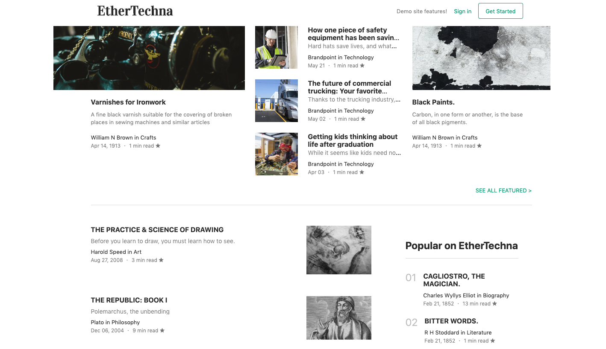
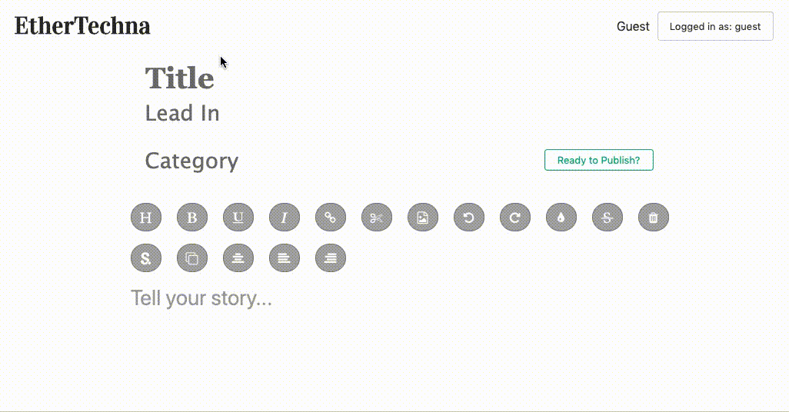

# **[Pintigue](https://pintrigue-app.herokuapp.com/)**


Live Site: [Pintigue](https://pintrigue-app.herokuapp.com/)


# **Tech Basis**
<a href="https://www.ruby-lang.org/en/"></a><a href="https://rubyonrails.org/"></a><a href="https://reactjs.org/"></a><a href="https://redux.js.org/"></a>

Crated with Ruby on Rails, React, and Redux, this single page app strives to create a seemless, user-centric experience where content is easy to produce, update, and beautify.

#### The Main Page splashes guests with works from the various would-be and well-read authors:





#### The Editor is simple and easy to jump into:



#### The User Authorization modal is created via a React Presentational component

```
class Modal extends React.Component {
  constructor(props) {
    super(props)
    this.renderErrors = this.renderErrors.bind(this)
  }

  renderErrors() {
    const sessionErrors = this.props.errors.map((error, i) => {
      return <li key={`error-${i + 1}`}>{ error }</li>
    })

    return (
      <ul className="modal-form-error-container">
        { sessionErrors }    
      </ul>
    )
  }

  render () {
    const { modal, closeModal } = this.props
    if (!modal) return null
  
    let component
    switch (modal) {
      case 'login':
        component = <LoginForm />
        break
      case 'signup':
        component = <SignupForm />
        break
      default:
        return null
    }
    return (
      <div className="modal-background" onClick={ closeModal } >
        <div className={ `modal-child modal-${modal}` } onClick={ e => e.stopPropagation() } >
          { component }
        </div>
        <div>
          { this.renderErrors() }
        </div>
      </div>
    )
  }
}

export default Modal
```

Verifying global state via reducer:
```
import { OPEN_MODAL, CLOSE_MODAL } from '../actions/modal_actions'

const modalReducer = (state = null, action) => {
  Object.freeze(state)
  switch (action. type) {
    case OPEN_MODAL:
      return action.modal
    case CLOSE_MODAL:
      return null
    default:
      return state
  }
}

export default modalReducer
```